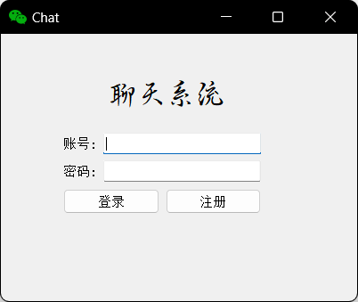
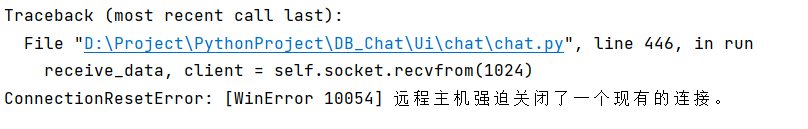
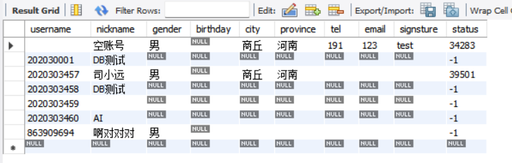

# 程序设计说明

## 一、文件结构

```bash
E:
│  main.py  // 主函数
│  
├─data
│  │  icon.png  // 程序图标
│  │  __init__.py
│  │  
│  └─avatar
│      ├─08
│      │  └─02
│      │     080261e4427a081fc6e637b654f590ee.png   // 头像    
│      └─f5
│         └─20
│            f5200f6894367c949cadd8f74c4ebe8c.png  // 头像
│                  
├─DB
│   data.py  // 数据库有关的函数都在这里
│    __init__.py
│      
└─Ui
   │  __init__.py
   │  
   ├─chat
   │  │  chat.py  // 聊天页面管理
   │  │  chatUi.py  // 聊天页面Ui的py版本
   │  │  chatUi.ui  // 聊天页面Ui的源程序
   │  │  __init__.py
   │  │  
   │  ├─addContact  // 添加联系人
   │  │      addContact.py
   │  │      addContactUi.py
   │  │      addContactUi.ui
   │  │      __init__.py
   │  │           
   │  ├─group  // 群聊
   │  │      addGroup.py
   │  │      addGroup.ui
   │  │      CreateGroup.py
   │  │      create_groupUi.py
   │  │      create_groupUi.ui
   │  │      Group.py
   │  │      GroupUi.py
   │  │      GroupUi.ui
   │  │      __init__.py
   │  │      
   │  ├─myinfo  // 个人信息查看与修改
   │  │      myinfo.py
   │  │      myinfoUi.py
   │  │      myinfoUi.ui
   │  │      __init__.py
   │  │      
   │  └─userinfo  // 联系人界面
   │     	  userinfoUi.py
   │          userinfoUi.ui
   │          __init__.py
   │          
   └─login  // 注册登录
        login.py
        loginUi.py
        loginUi.ui
        register.py
        registerUi.py
        registerUi.ui
        __init__.py
```

# 使用说明

## 1、导入我的数据库备份文件

```bash
mysql -u root -p
create database chat;
use chat;
source D:\数据库备份文件.sql;
```


## 2、打开\main\data\config.json

```json
//  在该文件中填写你的本地MySQL的账号密码已经数据库名，用于连接本地数据库
{
  "username": "root",  // MySQL用户名
  "password": "123456",  // MySQL密码
  "database": "chat"  // 数据库名
}
```

## 3、运行main.py



## 4、我的数据库中有一个空账号，所以点击登录即可进入聊天界面

下面是数据库中存储的几个账号，可以任意选择一个登录，也可自行注册

|  username  | password |     createTime      |
| :--------: | :------: | :-----------------: |
|            |          | 2022-12-19 20:27:07 |
| 202030001  |  123456  | 2022-12-24 23:42:34 |
| 2020303457 |  123456  | 2022-12-19 20:27:28 |
| 2020303458 |  123456  | 2022-12-23 14:25:31 |
| 2020303459 |          | 2022-12-24 21:01:42 |
| 2020303460 |  123456  | 2022-12-25 00:01:33 |
| 863909694  |  123456  | 2022-12-19 20:27:46 |

## 5、异常处理

我承认软件还有很多bug

如果使用过程中有任何异常情况导致程序闪退

那么请关闭软件重新登录（重启能解决80%的问题）

如果还不能解决，那么请重新注册一个账号，登录新账号（重装能解决100%的问题）

如果遇到了这种情况，是异常退出导致没有将用户状态设置为离线



请将userinfo表的status设置为-1，表示该账户已经退出登录


